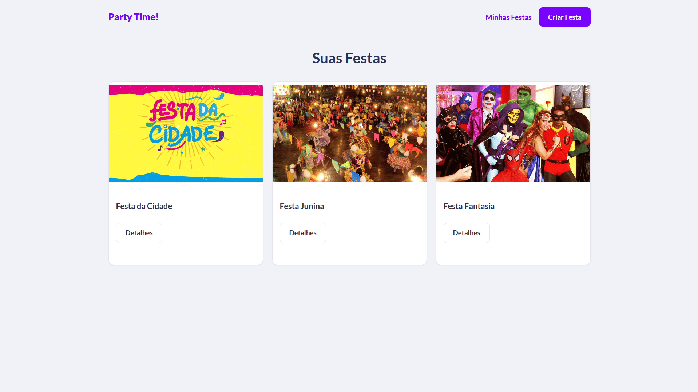
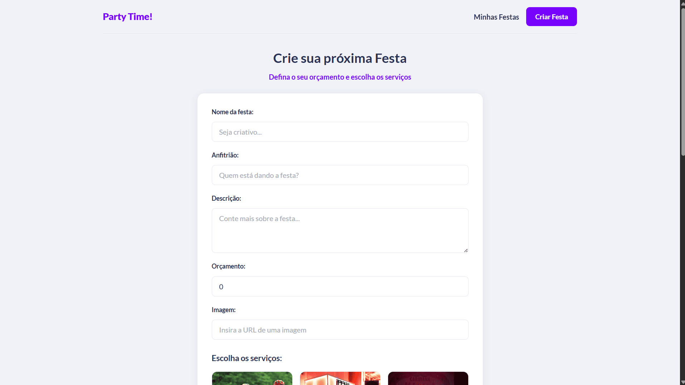
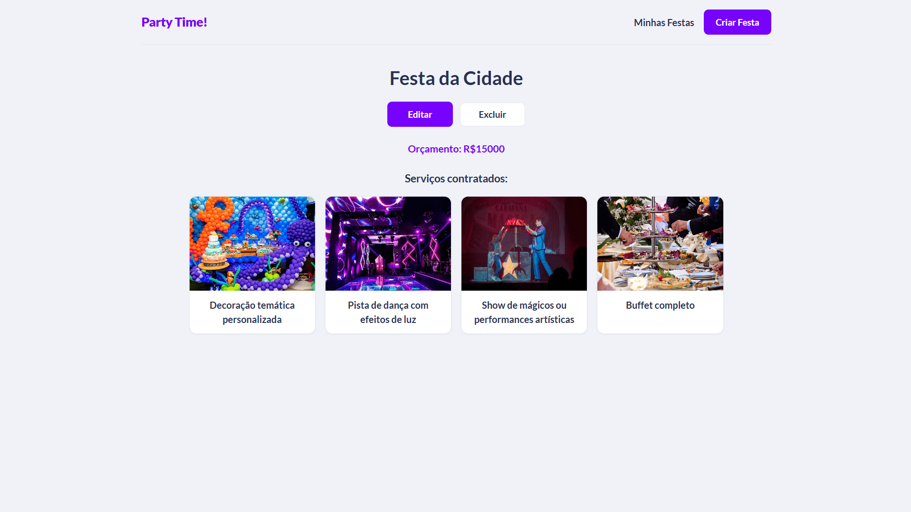

# PartyTime

**PartyTime** é uma aplicação web **fullstack** para planejamento, consulta e gestão de festas. O sistema permite cadastrar eventos com orçamento, imagem e descrição, além de associar serviços opcionais (buffet, decoração, música, entre outros) a partir de um catálogo pré-definido. Este documento apresenta a visão do produto, a interface do usuário, a arquitetura do repositório e o procedimento de configuração e execução do ambiente de desenvolvimento.

---

## Visão geral do produto

O PartyTime organiza o ciclo de vida de uma festa em quatro etapas principais: **listagem** (visualização de todas as festas na página inicial), **criação** (formulário com seleção de serviços), **detalhamento** (consulta de uma festa e dos serviços contratados) e **gestão** (edição ou exclusão do registro). A aplicação não exige autenticação: qualquer usuário com acesso à interface pode criar, visualizar, editar e remover festas, o que simplifica o uso em ambiente acadêmico e de demonstração.

| Camada        | Tecnologia     | Responsabilidade                                      |
|---------------|----------------|-------------------------------------------------------|
| Frontend      | React, Vite    | Interface, navegação e consumo da API REST            |
| Backend       | Express        | Regras de negócio, validação e persistência           |
| Banco de dados| MongoDB Atlas  | Armazenamento de festas e catálogo de serviços        |

---

## Interface do usuário

As telas abaixo ilustram o fluxo principal da aplicação. Cada imagem corresponde a uma rota do frontend e a um conjunto de operações descrito na seção.

### Home (`/`)

Página inicial. Exibe em grade todas as festas cadastradas, com imagem, título e atalho para os detalhes de cada evento.



*Tela inicial — listagem de festas*

### Create (`/party/new`)

Formulário de criação de festa. O usuário informa nome, anfitrião, descrição, orçamento e URL da imagem; em seguida seleciona os serviços desejados em cards interativos e submete o formulário.



*Formulário de criação de festa com seleção de serviços*

### Details (`/party/:id`)

Página de detalhes. Carrega os dados da festa pelo identificador na URL, exibe orçamento e serviços contratados, com atalhos para editar ou excluir o evento.



*Detalhes sobre a festa*

---

## Rotas do frontend

| Rota               | Tela        | Descrição                                      |
|--------------------|-------------|------------------------------------------------|
| `/`                | Home        | Listagem de todas as festas                    |
| `/party/new`       | Create      | Criação de nova festa e seleção de serviços    |
| `/party/:id`       | Details     | Detalhes e exclusão de uma festa               |
| `/party/edit/:id`  | Edit        | Edição dos dados e serviços de uma festa       |

---

## Estrutura do repositório

```
partytime/
├── backend/              # API REST (Express)
├── frontend/             # Interface (React + Vite)
└── README.md
```

---

## Pré-requisitos

Antes de iniciar, certifique-se de ter instalado:

* **Node.js** (versão 18 ou superior recomendada)
* **NPM** (vem junto com o Node)
* **MongoDB** (conta no [MongoDB Atlas](https://www.mongodb.com/cloud/atlas))
* **Git**

Verifique no terminal:

```bash
node -v
npm -v
git -v
```

---

## Backend

A partir da raiz do projeto:

```bash
cd backend
```

### Instalar dependências

```bash
npm install
```

### Configuração obrigatória do MongoDB

Se você não configurar isso corretamente, o **backend** não vai iniciar.

#### Passo a passo (MongoDB Atlas)

1. Acesse o **MongoDB Atlas** pelo navegador
2. Crie uma conta (ou faça login)
3. Clique em **Create Cluster** (use o plano gratuito)
4. Vá em **Database Access** e crie um usuário e senha
5. Vá em **Network Access** e adicione:

```
0.0.0.0/0
```

#### Obtendo a connection string

1. Clique em **Connect**
2. Escolha **MongoDB Driver** para conectar sua aplicação
3. Copie algo no formato:

```
mongodb+srv://user:<password>@cluster0.xxxxx.mongodb.net/?retryWrites=true&w=majority
```

### Variáveis de ambiente (Backend)

Crie um arquivo chamado **`.env`** na pasta `backend`.

Siga o modelo abaixo (ou o `.env.example`, se disponível no repositório):

```env
MONGO_URI="mongodb+srv://usuario123:<senha123>@cluster0.xxxxx.mongodb.net/?retryWrites=true&w=majority"
FRONTEND_URL=http://localhost:5173
```

**Regras importantes:**

1. Substitua `user` e `password` pelas credenciais do MongoDB Atlas
2. Nunca suba o arquivo `.env` para o GitHub
3. Use o `.env.example` apenas como modelo

### Executar o backend

```bash
npm run start
```

Servidor disponível em:

```
http://localhost:3000
```

---

## Frontend

A partir da raiz do projeto:

```bash
cd frontend
```

### Instalar dependências

```bash
npm install
```

### Variáveis de ambiente (Frontend)

Crie um arquivo chamado **`.env`** na pasta `frontend`.

```env
VITE_API_URL=http://localhost:3000/api/
```

**Observação:** o Vite exige que variáveis expostas ao cliente comecem com `VITE_`.

### Executar o frontend

```bash
npm run dev
```

Aplicação disponível em:

```
http://localhost:5173
```

---

## Uso recomendado em desenvolvimento

1. Inicie o backend (`npm run start` em `backend/`)
2. Inicie o frontend (`npm run dev` em `frontend/`)
3. Acesse `http://localhost:5173` no navegador
4. Crie uma festa em **Criar Festa**, selecione serviços e confira a listagem na home; use **Detalhes** para editar ou excluir

---

## Fluxo de inicialização

```bash
# Clonar o projeto
git clone https://github.com/mateuslucasjm/partytime.git

# Backend
cd partytime/backend
npm install
npm run start

# Frontend (em outro terminal)
cd ../frontend
npm install
npm run dev
```

---

## Endpoints da API

Base URL em desenvolvimento: `http://localhost:3000/api`

### Festas (`/parties`)

| Método | Rota            | Descrição                    |
|--------|-----------------|------------------------------|
| GET    | `/parties`      | Lista todas as festas        |
| POST   | `/parties`      | Cria uma nova festa          |
| GET    | `/parties/:id`  | Busca festa por ID           |
| PUT    | `/parties/:id`  | Atualiza uma festa           |
| DELETE | `/parties/:id`  | Remove uma festa             |

### Serviços (`/services`)

| Método | Rota              | Descrição                      |
|--------|-------------------|--------------------------------|
| GET    | `/services`       | Lista todos os serviços        |
| POST   | `/services`       | Cria um serviço no catálogo    |
| GET    | `/services/:id`   | Busca serviço por ID           |
| PUT    | `/services/:id`   | Atualiza um serviço            |
| DELETE | `/services/:id`   | Remove um serviço              |

O frontend consome principalmente `GET /services` (catálogo na criação/edição) e as rotas de `/parties` para o CRUD de festas.

---

## Tecnologias utilizadas

### Backend

* Node.js
* Express
* MongoDB / Mongoose

### Frontend

* React
* Vite
* React Router
* Axios
* CSS

---

## Observações importantes

* Backend e frontend devem estar rodando **simultaneamente**
* Certifique-se de que as portas **3000** e **5173** estejam livres
* Se alterar portas, atualize os arquivos `.env` (`FRONTEND_URL` e `VITE_API_URL`)
* As capturas em `frontend/src/assets/` refletem o estado visual atual da interface e podem ser atualizadas conforme o produto evoluir
* Em produção, configure `FRONTEND_URL`, `VITE_API_URL` e `MONGO_URI` de acordo com os domínios e o cluster reais da aplicação

